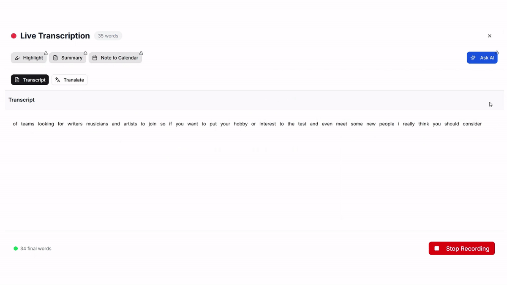

  <h1 align="center">MeetingMind</h1>

[product-screenshot]: ./assets/mockup-image.png
[![Product Name Screen Shot][product-screenshot]](./assets/mockup-image.png)

  

    Transcription your meeting in real-time from browser
     
     
  

[![][vercel-shield]][vercel-link]
[![CodeRabbit Pull Request Reviews][coderabbit-shield]][coderabbit-link]

The app is live and available to try <a href="https://meeting-mind-nu.vercel.app">here</a>  
(sometime the websocket server not working well cause i use free tier when deploying on Render)

  

  
Table of Contents

  <ol>
    <li>
      <a href="#about-the-project">About The Project</a>
      <ul>
        <li><a href="#demo">Demo </a></li>
        <li><a href="#built-with">Built With</a></li>
      </ul>
    </li>
    <li>
      <a href="#getting-started">Getting Started</a>
    </li>
  </ol>

## About The Project
### Demo

### Built With
* [![Next][Next.js]][Next-url]
* [![Go][Go]][Go-url]
* [![Supabase][Supabase]][Supabase-url]

## Getting Started
Reading the setup document right [here](./docs/setup.md)

[vercel-link]: https://meeting-mind-nu.vercel.app
[vercel-shield]: https://img.shields.io/badge/vercel-online-55b467?labelColor=black&logo=vercel&style=flat-square
[coderabbit-shield]: https://img.shields.io/coderabbit/prs/github/PhuocThinhkkk/MeetingMind?utm_source=oss&utm_medium=github&utm_campaign=PhuocThinhkkk%2FMeetingMind&labelColor=171717&color=FF570A&link=https%3A%2F%2Fcoderabbit.ai&label=CodeRabbit+Reviews
[coderabbit-link]: https://coderabbit.ai
[Next.js]: https://img.shields.io/badge/Next.js-15-black?style=flat-square&logo=next.js&logoColor=white
[Next-url]: https://nextjs.org/
[Go]: https://img.shields.io/badge/Go-1.21+-00ADD8?style=flat-square&logo=go&logoColor=white
[Go-url]: https://golang.org/
[Supabase]: https://img.shields.io/badge/Supabase-latest-3ECF8E?style=flat-square&logo=supabase&logoColor=white
[Supabase-url]: https://supabase.com/

